```mermaid
flowchart TD
A[Prometheus] --> B[Alertmanager]
B --> C[Flask Webhook]
C --> D[Ansible Heal Playbook]
D --> E[Restart Node Exporter]
E --> A


# ⚙️ Self-Healing Infrastructure with Prometheus, Alertmanager & Ansible  

This project demonstrates a **self-healing monitoring system** built using **Prometheus**, **Alertmanager**, **Flask**, and **Ansible** — where infrastructure issues (like Node Exporter going down) are **automatically detected, alerted, and remediated** without manual intervention. 

It simulates how real-world DevOps teams build **auto-recovery pipelines** to ensure production-grade reliability and zero-downtime monitoring. 

🩺 **In short:** Prometheus *detects* → Alertmanager *alerts* → Flask Webhook *triggers* → Ansible *heals*.


## 🧩 Project Overview & Tool Roles  

This project demonstrates a **self-healing cloud monitoring system** using open-source DevOps tools. Each component plays a distinct role in automating detection, alerting, and recovery:  

- 🟢 Prometheus — Collects system metrics and continuously monitors service health.  
- 🚨 Alertmanager — Manages and routes alerts triggered by Prometheus.  
- 🌐 Flask (Webhook Server) — Acts as a custom receiver that listens for Alertmanager notifications and initiates recovery workflows.  
- 🛠️ Ansible (heal.yml) — Executes automated remediation actions (e.g., restarts failed services).  
- 📈 Node Exporter — Exposes host-level metrics to Prometheus for real-time monitoring.  

Together, these tools form an **auto-healing monitoring pipeline** — when **Node Exporter goes down**, **Prometheus** detects the failure → **Alertmanager** fires an alert → **Flask webhook** triggers the **Ansible playbook**, which automatically restores the service.


## 🧩 Phase 1 — Environment Setup

### 1.1 EC2 & Network Configuration

- **Instance:** Ubuntu 22.04 LTS (AWS Free Tier `t2.micro`)
- **Security Groups:**  
  - `22` → SSH  
  - `80` → Nginx (optional for health page)  
  - `9090` → Prometheus  
  - `9093` → Alertmanager  
  - `9100` → Node Exporter  
  - `5001` → Flask Webhook listener  

All inbound rules verified successfully.  
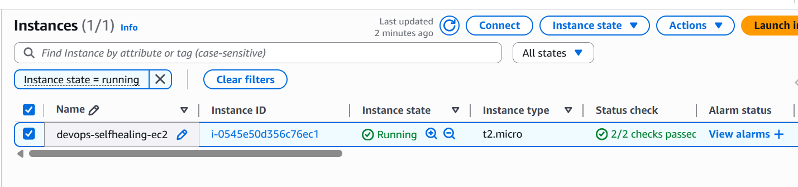  
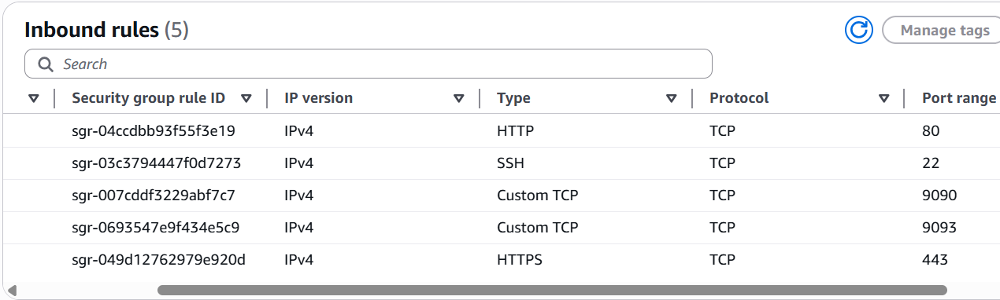

### 1.2 Install Prerequisites

* Installed base utilities and dependencies:

## ▶️ Run the Following Commands

sudo apt update -y
sudo apt install -y wget curl unzip python3 python3-pip ansible nginx
pip3 install flask

* Python 3.10+, Flask installed successfully
* Ansible verified via ansible --version
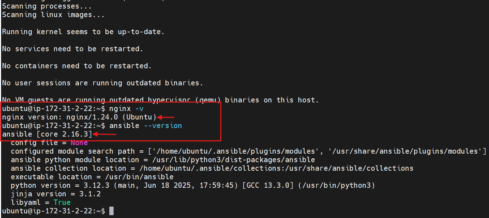

* Nginx running as a test service
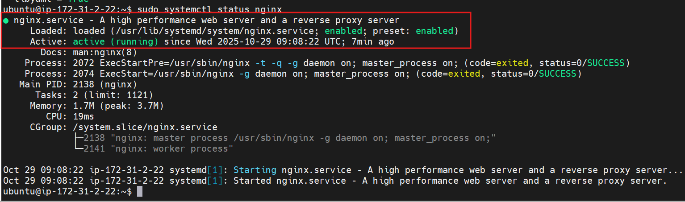

## 📡 Phase 2 — Monitoring Stack Configuration

## 2.1 Prometheus Setup

* Version: v2.53.0
* Installed under /opt/prometheus

## ▶️ Run the Following Commands

wget https://github.com/prometheus/prometheus/releases/download/v2.53.0/prometheus-2.53.0.linux-amd64.tar.gz
tar -xzf prometheus-2.53.0.linux-amd64.tar.gz
sudo mv prometheus-2.53.0.linux-amd64 /opt/prometheus

 // Prometheus config — /opt/prometheus/prometheus.yml

global:
  scrape_interval: 10s

alerting:
  alertmanagers:
    - static_configs:
        - targets: ['localhost:9093']

rule_files:
  - "alert_rules.yml"

scrape_configs:
  - job_name: 'node_exporter'
    static_configs:
      - targets: ['localhost:9100']

  - job_name: 'prometheus'
    static_configs:
      - targets: ['localhost:9090']

  - job_name: 'nginx'
    static_configs:
      - targets: ['localhost:9100']

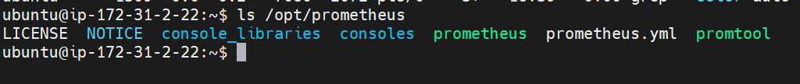
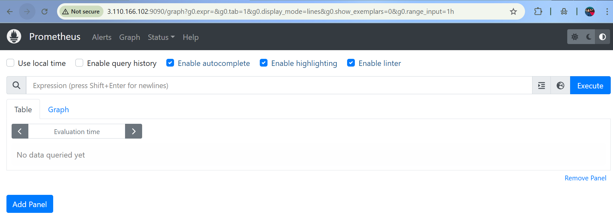

## 2.2 Node Exporter Installation

* Version: v1.8.1
* Binary placed under /opt/node_exporter/
* Managed via systemd for restart control

## ▶️ Run the Following Commands

wget https://github.com/prometheus/node_exporter/releases/download/v1.8.1/node_exporter-1.8.1.linux-amd64.tar.gz
tar -xzf node_exporter-1.8.1.linux-amd64.tar.gz
sudo mv node_exporter-1.8.1.linux-amd64 /opt/node_exporter

// Service file: /etc/systemd/system/node_exporter.service

[Unit]
Description=Prometheus Node Exporter
After=network.target

[Service]
User=root
ExecStart=/opt/node_exporter/node_exporter
Restart=always
RestartSec=5

[Install]
WantedBy=multi-user.target

✅ Verified process and metrics availability.
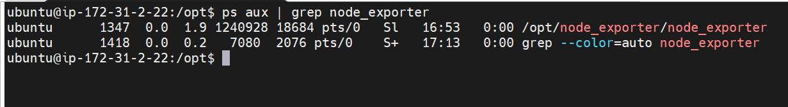
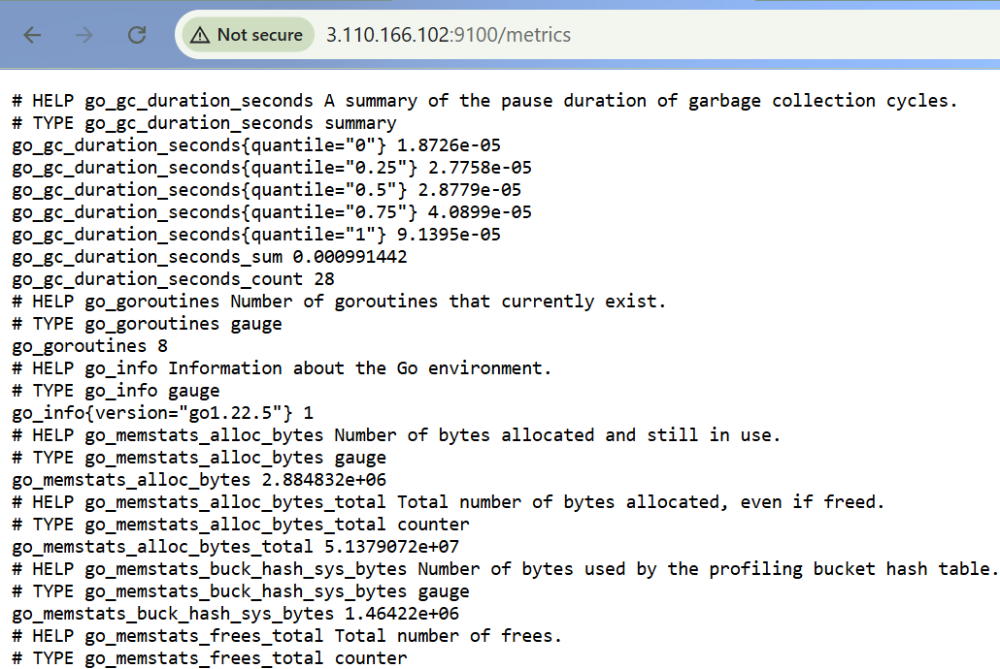

## 2.3 Add Target in Prometheus

Confirmed Node Exporter target visible and status: UP.
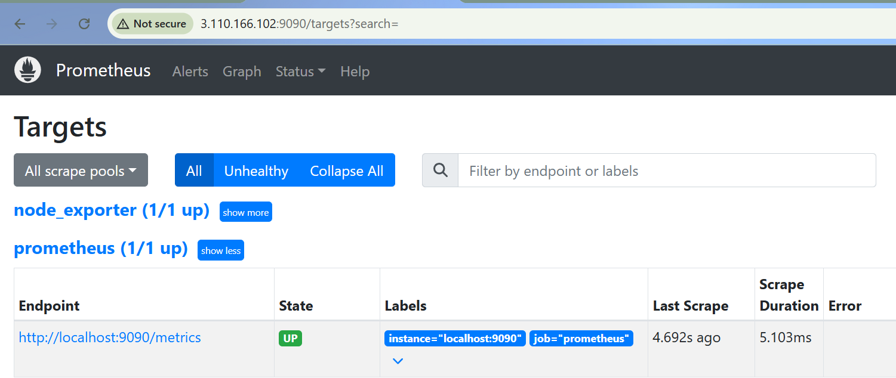

## 2.4 Alertmanager Installation

* Version: v0.27.0
* Installed in /opt/alertmanager

## ▶️ Run the Following Commands

wget https://github.com/prometheus/alertmanager/releases/download/v0.27.0/alertmanager-0.27.0.linux-amd64.tar.gz
tar -xzf alertmanager-0.27.0.linux-amd64.tar.gz
sudo mv alertmanager-0.27.0.linux-amd64 /opt/alertmanager

// Alertmanager config: /opt/alertmanager/alertmanager.yml

route:
  receiver: 'webhook-receiver'

receivers:
  - name: 'webhook-receiver'
    webhook_configs:
      - url: 'http://localhost:5001/'

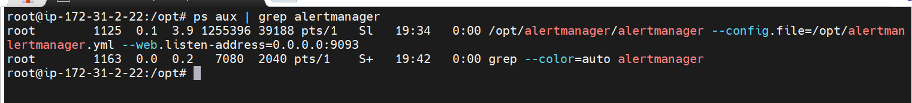
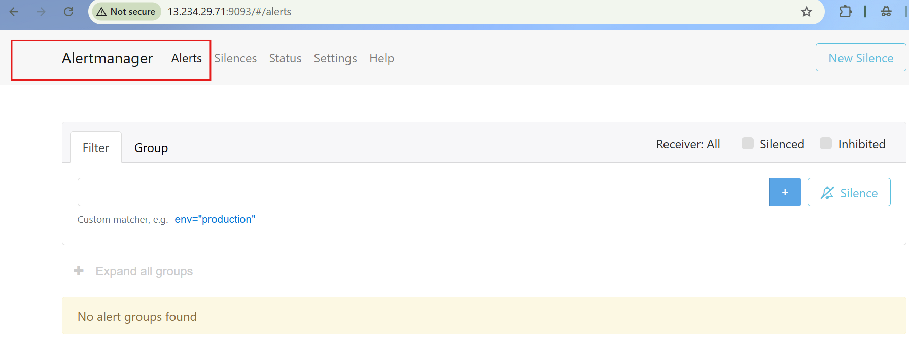
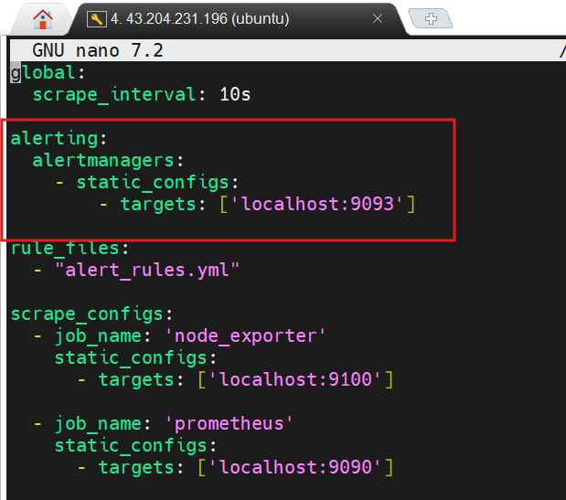

## 2.5 Alert Rules Configuration

// File: /opt/prometheus/alert_rules.yml

groups:
- name: service-alerts
  rules:
  - alert: NodeExporterDown
    expr: up{job="node_exporter"} == 0
    for: 15s
    labels:
      severity: critical
    annotations:
      description: "Node Exporter is down on {{ $labels.instance }}"

✅ Updated Prometheus config to include rules file.

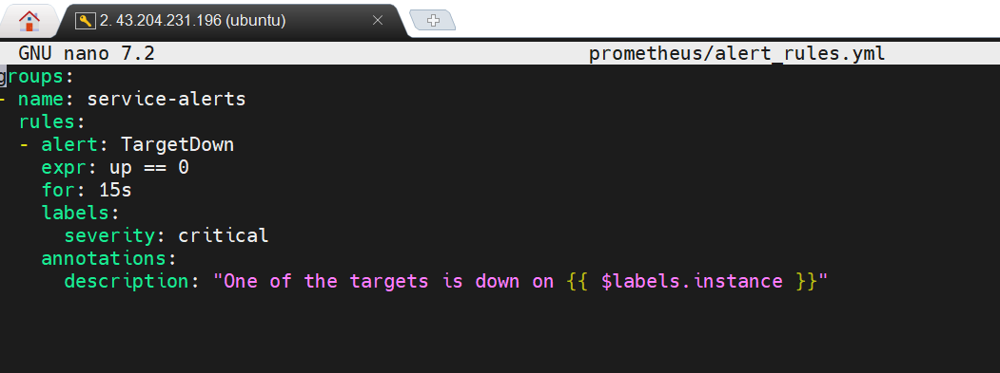
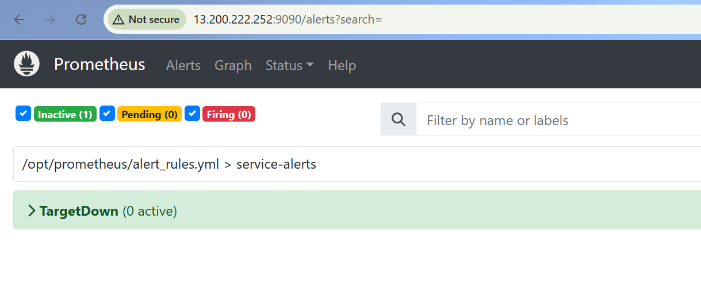
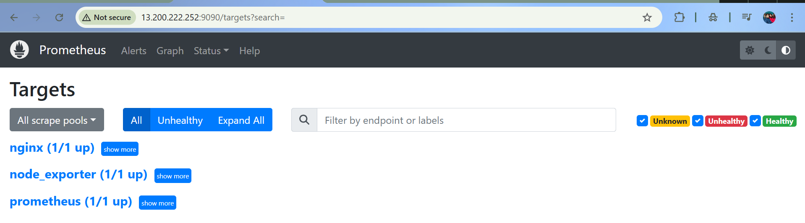

✅ Verified alert fires when Node Exporter goes down.


## 🤖 Phase 3 — Webhook & Auto-Healing Integration

## 3.1 Flask Webhook Server
Implemented lightweight Flask listener for Alertmanager alerts.

// File: /opt/webhook_server.py

from http.server import BaseHTTPRequestHandler, HTTPServer
import subprocess, datetime

class WebhookHandler(BaseHTTPRequestHandler):
    def do_POST(self):
        self.send_response(200)
        self.end_headers()
        with open("/opt/webhook.log", "a") as f:
            f.write(f"[{datetime.datetime.now()}] Webhook triggered\n")
        subprocess.run(["ansible-playbook", "/opt/heal.yml"], check=False)
        with open("/opt/webhook.log", "a") as f:
            f.write(f"[{datetime.datetime.now()}] heal.yml executed\n")

if __name__ == "__main__":
    server = HTTPServer(("0.0.0.0", 5001), WebhookHandler)
    with open("/opt/webhook.log", "a") as f:
        f.write(f"[{datetime.datetime.now()}] Webhook server started\n")
    server.serve_forever()

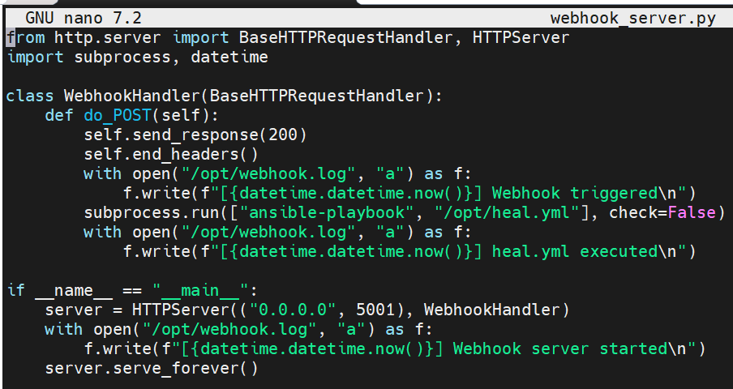
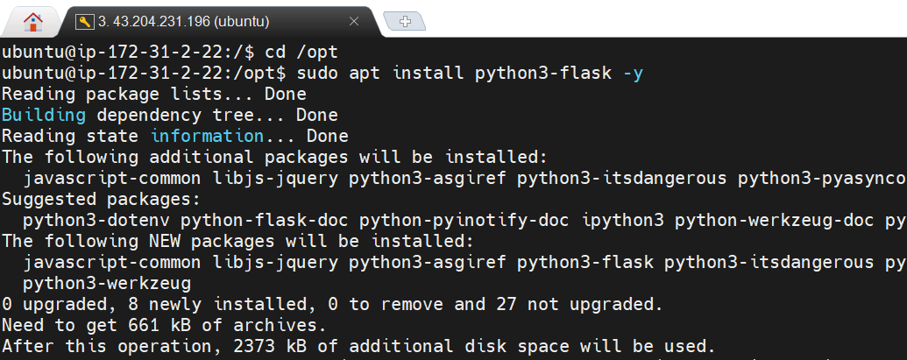
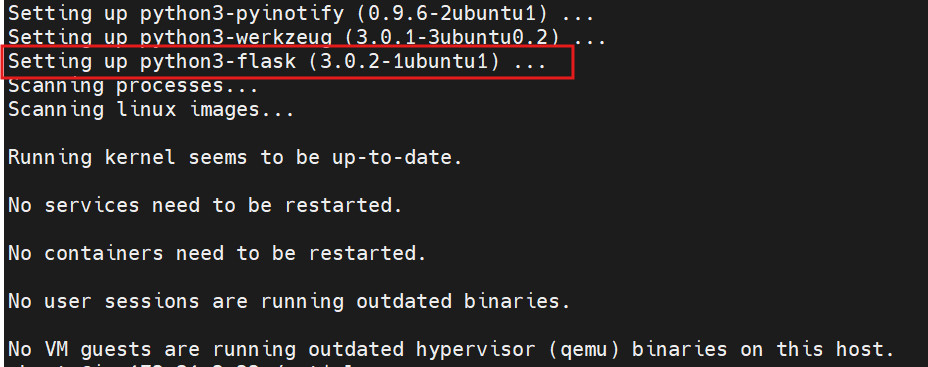
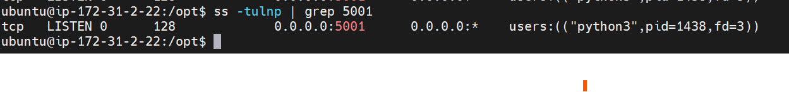

## ▶️ Run command:

sudo nohup python3 /opt/webhook_server.py > /opt/webhook.log 2>&1 &

* This command runs the Flask webhook server in the background, allowing it to continuously listen for incoming alerts from Alertmanager and trigger the healing playbook automatically.

## 3.2 Auto-Healing Ansible Playbook

// File: /opt/heal.yml

---
- name: Restart Node Exporter if down
  hosts: localhost
  become: yes
  tasks:
    - name: Ensure Node Exporter service is restarted
      ansible.builtin.systemd:
        name: node_exporter
        state: restarted

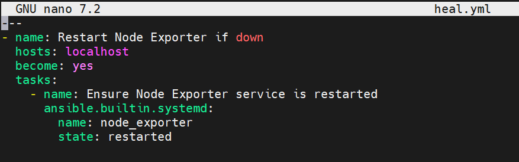

## 3.3 Alertmanager Webhook Configuration

* Integrated webhook URL inside Alertmanager config.

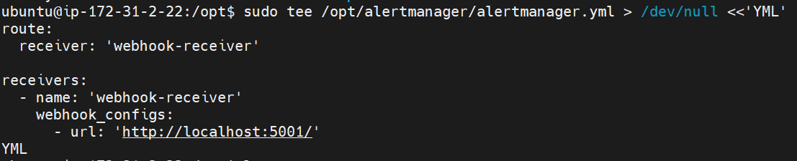

* ✅ Restarted Alertmanager to apply configuration.

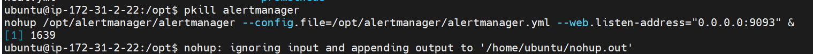


## 🔄 Phase 4 — Failure Simulation & Self-Healing Validation

## 4.1 Simulate Failure

* Manually terminated Node Exporter process:

## ▶️ Run command:

sudo pkill -9 -f node_exporter

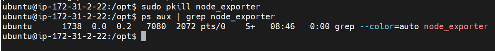

* Prometheus detected the downtime within seconds.

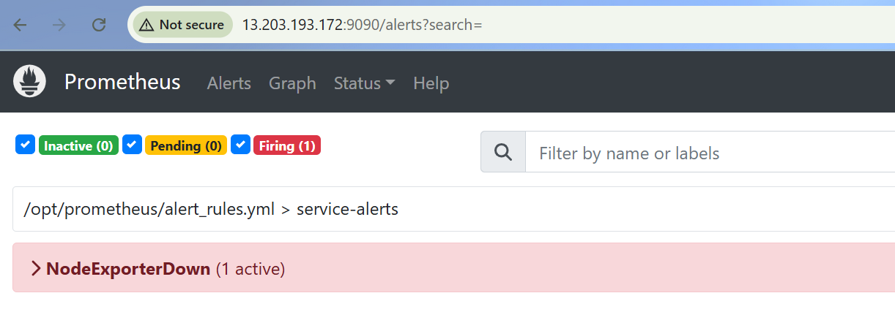

## 4.2 Automatic Recovery

Alertmanager triggered webhook → Flask server → executed Ansible playbook.

// Logs verified:

[2025-11-01 15:34:54.624642] heal.yml executed

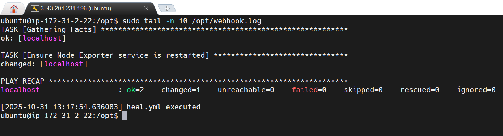
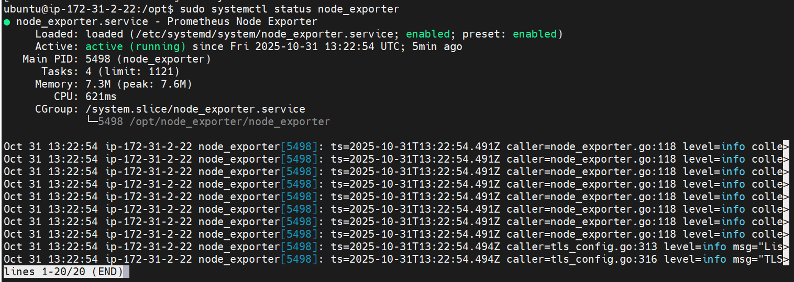

✅ Node Exporter automatically restarted and Prometheus alert resolved.
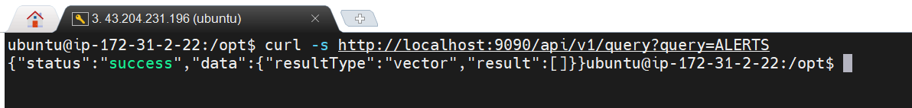

## 🏁 Project Outcome & Takeaways

By the end of this project, we built a **fully automated, self-healing monitoring pipeline** — the kind of system real DevOps teams strive for in production.

From setup to automation, every layer worked together seamlessly:

* **Prometheus** continuously monitored system health and detected failures.
* **Alertmanager** transformed those detections into actionable alerts.
* **Flask Webhook** acted as a smart middleman, catching alerts and triggering responses.
* **Ansible** became the hands that “healed” the system — restarting services without human touch.
* **Node Exporter** played the vital role of the monitored service, proving our automation loop works end-to-end.

💡 **In essence:**
When Node Exporter went down, the system *knew it, reacted, and fixed itself.*

This project reflects how **DevOps automation transforms chaos into resilience** — showing that with the right tools and mindset, infrastructure can truly take care of itself.

## 📽️ Bonus: Demonstration Video (Recommended)

Attached is the proof-of-concept demo video here — showing the Node Exporter going down → alert firing → automatic recovery.

🎥 [Watch the Auto-Healing in Action](videos/auto-heal-demo.mp4)

🧾 Author Notes

This project was built from scratch on a Free-Tier EC2 instance, replicating real-world DevOps workflows — monitoring, alerting, and self-healing — all using open-source tools.

Tags: #Prometheus #Alertmanager #Ansible #Flask #DevOps #AWS #Self-Healing

⭐ Tip: Fork this repo, update targets, and experiment with service-specific auto-healing logic (e.g., restart nginx, database, etc.).
